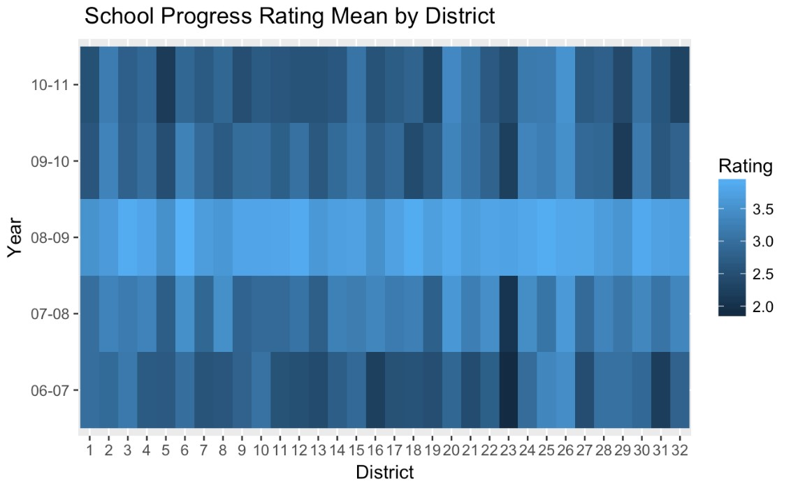

# NYC-K-12-Education-Analysis
As follows is some interesting analysis extracted from the complete version : 
[complete version](https://github.com/KunyiLiu/NYC-K-12-Education-Analysis/NYC-K-12-Education-Analysis.nb.html)
## Introduction
In order to figure out the education condition in NYC and give some advice to policy makers and students and their parents on school selection and self-improvement, we expect to analyze some local schools’ and students’ datasets.
We concentrated on analyses of K-12 and senior education. We divided our assignment into three part:  
1) Students’ information visualization and analysis.   
2) Schools’ information visualization and analysis.   
3) Further analysis and suggestions.   
## Graduation Rates w.r.t District
Our project concentrated on analyses of NYC K-12  education. We have built an interactive Heat Map of NYC school district on a web to show the graduation rate of different districts. We found that education levels and students’ performances are various from different districts, which may related to some social factors discussed followed.  
Here is our interactive map link: https://plnkr.co/edit/n3D6hCEnh2kdNK8pEdym?p=preview  

## Heatmap of the Graduation Rate among Districts
  
The two districts with the best graduation rate were District 26 and District 13, and the districts with the decent graduation rates were 28, 22 and 4.   
On the other hand, the graduation rate of District 23, 16 and 8 was the lowest.
## Math and ELA Covariance Matrix by levels
    
Level1: Below proficient, Level2: Partly proficient , Level3: Proficient, Level4: Excel proficient
According to the graphs in diagonal, we find that students’ performance level of ELA and Math are related. They are positively linearly associative.
## School Progress Evaluation
  
School progress was designed to help parents, teachers, principals, and others understand how well schools are doing.
## Possible correlation on income and students’ academic performance

There is a relatively high positive correlation between income and academic performance of the districts, which means ,in general, with higher income invested, there comes better academic performance of students.

